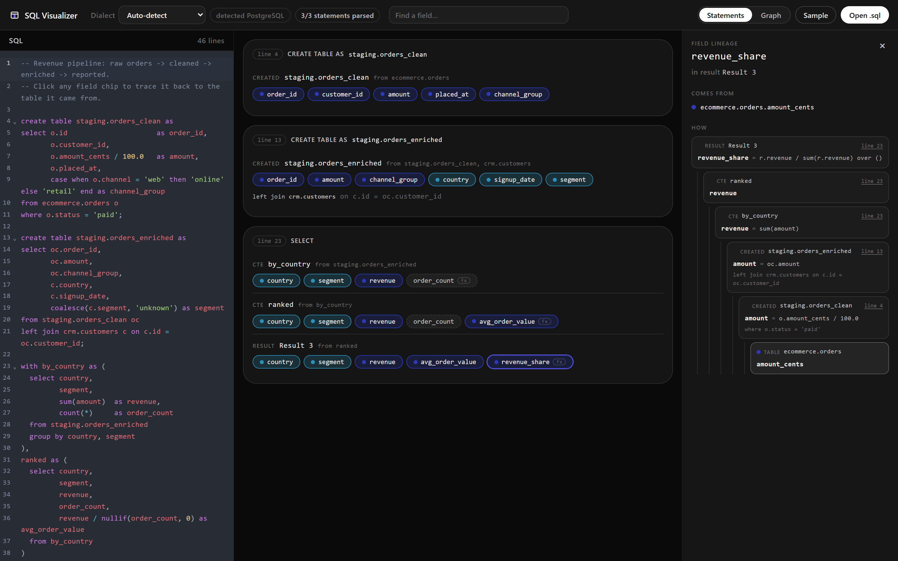
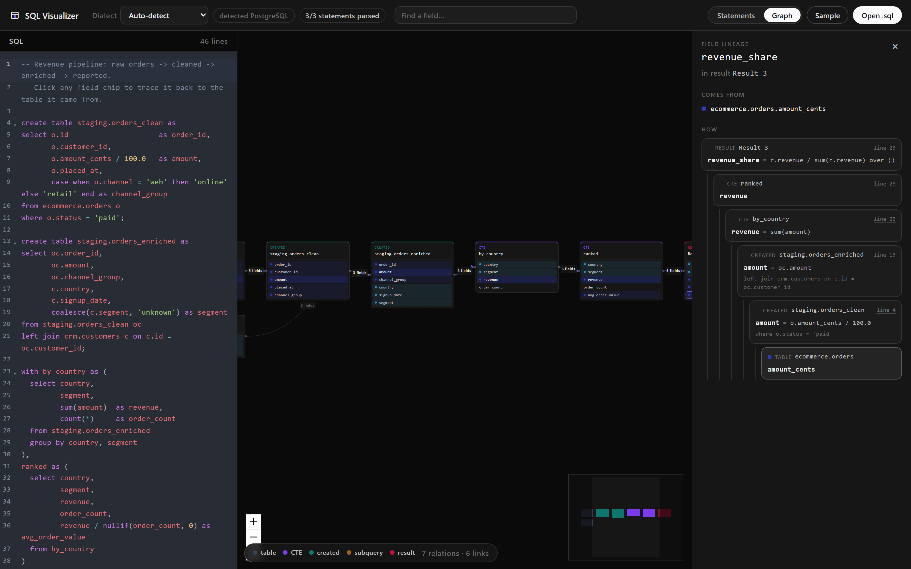

# SQL Visualizer — Column-Level SQL Lineage in Your Browser

**Trace any field in a long SQL script back to the table it came from — and see exactly how it was derived along the way.**

[](LICENSE)
[](https://govindskatyura.github.io/sql-visualizer/)
[](src/lineage/lineage.test.js)
[](https://github.com/Govindskatyura/sql-visualizer/issues)

Free and open source under the [MIT License](LICENSE) — use it, fork it, ship it commercially.

[**▶ Open the live demo**](https://govindskatyura.github.io/sql-visualizer/) · [Report an issue](https://github.com/Govindskatyura/sql-visualizer/issues)

Open a `.sql` or `.sas` file of any length, click a field, and get its full lineage: every hop back to the base tables, with the expression that produced the value at each step. Works through CTEs, subqueries, `UNION` branches and `CREATE TABLE AS` chains, across multiple statements — and through SAS DATA steps, PROC SQL and PROCs. Everything runs client-side — your SQL is never uploaded.



---

## The problem

You open a 300-line SQL script and need to answer one question: **where does this column actually come from?**

Reading it top to bottom doesn't scale. The value you care about was renamed in a CTE, divided by 100 two statements earlier, and originally lived in a column with a different name in a table nobody mentions any more. SQL Visualizer answers that question in one click.

For the example above, `revenue_share` resolves to:

```
Result 3.revenue_share  = r.revenue / sum(r.revenue) over ()
└─ ranked.revenue
   └─ by_country.revenue          = sum(amount)
      └─ staging.orders_enriched.amount  = oc.amount
         └─ staging.orders_clean.amount  = o.amount_cents / 100.0
            └─ ecommerce.orders.amount_cents   ← origin
```

## Features

- **Column-level lineage across statements.** A table created by `CREATE TABLE AS` or `INSERT ... SELECT` is resolved as a source in every later statement, so lineage crosses statement boundaries.
- **The expression at every hop**, not just the table name — you see *how*, not only *where from*.
- **Origin coloring.** Each field is colored by the base table it ultimately comes from, so a whole script is readable at a glance.
- **Interactive lineage graph.** A pan/zoom DAG of every table, CTE and result in the script, with the selected field's path highlighted.
- **Field search.** Filter hundreds of fields down to the ones you're looking for.
- **14 SQL dialects and SAS**, with automatic detection. SAS DATA steps, PROC SQL and the table-shaped PROCs are traced in the same graph as SQL.
- **Honest about uncertainty.** Ambiguous references and partially-parsed statements are flagged rather than guessed at.
- **Private by design.** No server, no upload, no account.

## Lineage graph



## Quick start

```bash
npm install
```

```bash
npm start
```

```bash
npm test
```

Then open <http://localhost:3000>. Paste your SQL or SAS, or use **Open file** to load a `.sql` or `.sas` script.

## Supported SQL dialects

BigQuery · Snowflake · PostgreSQL · MySQL · MariaDB · Redshift · Hive · Flink SQL · Trino/Presto · Athena · SQLite · T-SQL (SQL Server) · Db2 · generic ANSI SQL

Auto-detect parses a sample of your script with each candidate and picks the one that handles it, using syntax fingerprints (`UNNEST`, `QUALIFY`, `LATERAL VIEW`, backtick-qualified tables, and so on) to break ties. You can also select a dialect manually.

## SAS

Open a `.sas` file and the whole program is traced in one graph — a DATA step, a PROC SQL query and a PROC SUMMARY are hops in the same chain, so a report variable resolves all the way back to the raw dataset it came from. SAS is recognized automatically; you can also pick it in the dialect list.

What is read:

| Construct | How it is traced |
| --- | --- |
| `DATA` step | Every input variable flows through as an implicit `*`, plus one column per assignment. `KEEP`, `DROP` and `RENAME` are applied, on the step and as dataset options. |
| `SET` / `MERGE` / `UPDATE` | All inputs become sources; `BY` variables are shown the way a join key is. |
| Assignments | `total = a + b` depends on `a` and `b`; `if channel = 'web' then grp = 'online'` also depends on `channel`, exactly as the equivalent `CASE` would. A variable assigned earlier in the step resolves to that assignment, not to a dataset column. |
| `PROC SQL` | Handed to the SQL engine, with `CALCULATED`, column `LABEL=`/`FORMAT=` and `SELECT ... INTO :macro` normalized first. |
| `PROC SORT` / `TRANSPOSE` / `APPEND` and other `DATA=`/`OUT=` procs | Table-level lineage from the input to the output dataset. |
| `PROC SUMMARY` / `MEANS` | `output out=x sum(amount)=revenue` maps `revenue` back to `amount`; `CLASS` and `BY` variables carry through. |
| `%LET` macro variables | Substituted before parsing, so `&lib..orders` resolves to the real dataset. An unresolved reference becomes a visible `mv_` placeholder rather than a parse error. |
| One-level names | Qualified to `WORK`, so a PROC SQL table and a DATA step that reads it land on the same node. |

Not read: `%MACRO` control flow (the steps inside a macro are parsed, the `%IF`/`%DO` logic around them is not), pass-through SQL inside `CONNECT TO` / `EXECUTE ... BY` (it is another database's dialect), `ARRAY` and `DO` loop element assignments, and `INFILE`/`DATALINES` input.

## FAQ

### How do I find which table a SQL column comes from?

Paste the script and click the field. The trace panel shows every hop back to the base table, including the expression that produced the value at each step — so you get both the origin and the derivation.

### Does it follow columns through CTEs and temporary tables?

Yes. CTEs are resolved within their statement, and tables created by `CREATE TABLE AS` or `INSERT ... SELECT` are resolved as sources in later statements. A chain of forty staging tables traces end to end.

### Does it handle UNION?

Yes. A set operation's output column draws from the column at the same position in every branch, so `UNION` branches with differently-named columns (`ts` and `created_at`) both show up as origins.

### What happens if it can't parse a statement?

That statement falls back to heuristics and is marked **partial parse**. The rest of the script is unaffected — one exotic statement never blanks the whole view.

### Can it trace SAS DATA steps, not just PROC SQL?

Yes. DATA steps, PROC SQL and the table-shaped PROCs are read into one model, so a chain that starts in a DATA step, passes through PROC SQL and ends in PROC SUMMARY traces end to end. See [SAS](#sas) for what each construct contributes.

### Is my SQL sent anywhere?

No. Parsing and lineage analysis run entirely in your browser.

### Why is a field uncolored?

Because it doesn't have exactly one origin. A field combining two tables shows a source count instead of a color, and a field computed without reading any column (a literal, or `count(*)`) is shown with a dashed border. Guessing a single color for those would be a confident wrong answer.

## Reading the display

| Marker | Meaning |
| --- | --- |
| Colored chip + dot | Resolves to exactly one base table; the color identifies it. |
| Uncolored chip with a count | Combines several base tables. |
| Dashed chip | Computed without reading a column (literal, or `count(*)`). |
| `fx` badge | The field is an expression, not a plain column reference. |
| *partial parse* | Statement fell back to heuristics; treat its lineage as best-effort. |
| *ambiguous* | An unqualified column name that several source tables could supply — qualify it in the SQL to resolve. |

## How it works

`src/lineage/` is the engine and has no React dependency:

| Module | Role |
| --- | --- |
| `scanner.js` | Character-level SQL scanning — splits statements and select lists without being fooled by strings, comments or nested parens. |
| `sasScanner.js` | The same job for SAS, which lexes differently: `*`-comments, no `--` comment, and semicolons that end a statement regardless of parens. |
| `sas.js` | Reads DATA steps and PROCs into the same model, and hands PROC SQL blocks to `parse.js`. |
| `dialects.js` | Dialect registry, syntax fingerprints, auto-detection. |
| `parse.js` | Normalizes a [node-sql-parser](https://github.com/taozhi8833998/node-sql-parser) AST into statements, relations and columns, with a heuristic fallback. |
| `graph.js` | Builds the cross-statement lineage graph and walks it (`traceColumn`, `traceOrigins`). |
| `colors.js` | Deterministic per-table colors, hashed from the table name. |

`src/components/` holds the UI: `SqlEditor` (CodeMirror), `StatementView` (chips), `GraphView` ([React Flow](https://reactflow.dev)), `TracePanel` and `Toolbar`.

Engine regression tests are in `src/lineage/lineage.test.js` — 45 cases covering scanning, dialect detection, multi-hop tracing, UNION branches, deep chains and the SAS readers.

## Known limits

- Lineage is derived from the script alone. Without a schema, unqualified columns can't always be attributed, and `select *` from a table not defined in the script expands to a wildcard rather than real column names.
- `MERGE` and statements outside `SELECT` / `CREATE TABLE AS` / `INSERT ... SELECT` / `CREATE VIEW` are listed but contribute no lineage.
- In SAS, a variable read by a step with several inputs is attributed to every input that could hold it, because SAS references are unqualified; `KEEP` and `DROP` on the inputs narrow that down. Macro-generated code is only as traceable as its `%LET` values make it.
- The bundle is dominated by `node-sql-parser`, which carries every dialect grammar. Code-splitting it is the first optimization worth making.

## Deploying

```bash
npm run deploy
```

Publishes to GitHub Pages using the `homepage` field in `package.json`.

## Contributing

Issues and pull requests are welcome. Please run `npm test` before opening a PR — the lineage engine is covered by tests, and lineage bugs are easy to introduce and hard to spot by eye.

## License

[MIT](LICENSE) © Govind Singh.

Free to use, copy, modify, publish and distribute, including commercially and in
closed-source products. The only condition is that the copyright notice and
permission notice stay with copies of the software. No warranty is provided.

The lineage engine in `src/lineage/` has no React dependency, so it can be lifted
into another project on its own under the same terms.

### Third-party licenses

All dependencies are permissively licensed and compatible with MIT redistribution.
Most are MIT; two are Apache-2.0 and are acknowledged here:

- [node-sql-parser](https://github.com/taozhi8833998/node-sql-parser) — Apache-2.0
- [web-vitals](https://github.com/GoogleChrome/web-vitals) — Apache-2.0

Neither ships a `NOTICE` file, so no additional notice redistribution is required.
